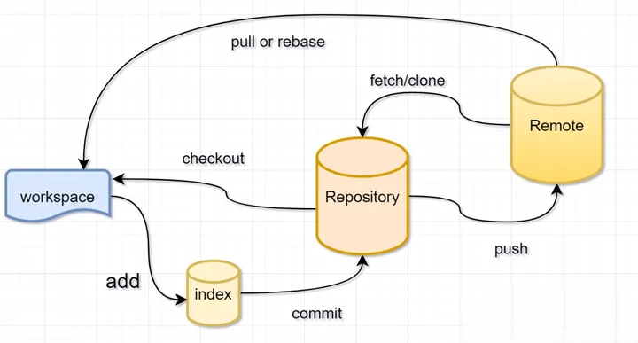

git是一个分布式版本控制系统，可以高效地进行项目版本管理。本文详细解释git的基本原理、工作流程和常用命令，并阐述实际开发中，如何使用git规范的对项目进行版本控制和管理。

## 工作流程

git工作流程如图所示：

- 使用 **pull** 命令从远程仓库拉取项目最新代码；
- 在工作目录，对文件进行编辑；
- 使用 **add** 命令将改动的文件提交到暂存区；
- 使用 **commit** 命令将暂存区中的文件提交到本地仓库；
- 使用 **push** 命令将本地仓库中的文件推送到远程仓库；

## 常用命令

命令一般以git开头，执行成功不会出现提示信息。

